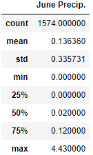

# Surf's Up with Advanced Data Storage and Retrieval

## Surf's Up
In this module, we have decided to open our own shop in Hawaii that sells both surfing gear and ice cream, and it will be called Surf 'n Shake. In order to achieve this dream, we must attract investors. However, the investors need to be convinced that this shop will be profitable based on the weather in Oahu since surfing and eating ice cream are very weather-dependent activities. We've been given eight years worth of weather data [hawaii.sqlite](hawaii.sqlite) from weather stations across Oahu that includes the temperature and precipitation as a function of the date. In this Challenge assignment, we are tasked with using Python, Pandas, and SQLAlchemy to show weather statistics for June and December in Oahu just to make sure the climate is appropriate for surfing and ice cream year round.

These calculations are divided into the two deliverables shown below (from the Module Challenge webpage), along with substasks for each deliverable which we will walk through further down. The text for each deliverable is taken from the starter files. Below each subtask is an image of the Python script necessary to complete it. All Python script used in this Challenge can be found in [SurfsUp_Challenge.ipynb](SurfsUp_Challenge.ipynb).

- **Deliverable 1: Determine the Summary Statistics for June**. Use Python, Pandas, and SQLAlchemy to filter the date column of the Measurements table in the database to retrieve all the temperatures for the month of June. This data is converted to a DataFrame and the `describe` function is used to generate the required summary statistics.
- **Deliverable 2: Determine the Summary Statistics for December**. Use Python, Pandas, and SQLAlchemy to filter the date column of the Measurements table in the database to retrieve all the temperatures for the month of December. This data is converted to a DataFrame and the `describe` function is used to generate the required summary statistics.

## Resources
- Software: Python 3.7.7, Conda 22.11.0, Jupyter Notebook 5.7.10, SQLAlchemy 1.4.39

## Deliverable 1: Determine the Summary Statistics for June

1. Write a query that filters the Measurement table to retrieve the temperatures for the month of June. 

    

2. Convert the June temperatures to a list.

    

3. Create a DataFrame from the list of temperatures for the month of June. 

    

4. Calculate and print out the summary statistics for the June temperature DataFrame.

    

## Deliverable 2: Determine the Summary Statistics for December

1. Write a query that filters the Measurement table to retrieve the temperatures for the month of December. 

    

2. Convert the December temperatures to a list.

    

3. Create a DataFrame from the list of temperatures for the month of December. 

    

4. Calculate and print out the summary statistics for the December temperature DataFrame.

    

## Analysis

### Results
The summary statistics for the temperatures in June and December are shown below.

A few initial conclusions can be drawn from these data:

- The low temperature is about 8° lower in the winter compared to the summer.
- The high temperatures are only 2° apart in the winter and summer.
- The average temperature in June is 75 ± 3°F while the average in December is 71 ± 4°F. These averages fall within each others' standard deviations, so the average temperatures in June and December are statistically the same.

### Summary
Based on the results from the temperature data above, opening the shop would be a good idea. First, even in the winter, the low temperature is still warm enough to be able to surf if wearing the correct wet suit (which the shop can sell!). Next, the high temperatures are nearly the same, so ice cream is can definitely be sold year round. Finally, the average temperatures are statistically the same, so there will be perfect days for surfing year round.

Another way to visualize the differences in temperatures is to plot them as a histogram for each month as shown below. The number of warmer days is certainly higher in June, but the weather in December is still perfectly surfable.

Temperature is not the only key weather factor when it comes to surfing and ice cream. An additional query can be performed to obtain a similar analysis of preciptation data. Summary statistics tables and histograms can be seen below. Once again, the average precipitation amounts are statistically the same. Looking at the histograms, it's clear that the vast majority of days see no rainfall (the shop can also sell sunscreen!). The maximum precipitation amount is higher in December, but this should not be an issue since it rains so infrequently. Based on precipitation data, the shop remains a good idea.

One final query would be to use the past weather data to try to predict future weather data to ensure that the shop will be profitable well into the future. Because of climate change, we might expect the average temperatures on the island to increase over time, which would be beneficial to the shop. However, climate change could also potentially increase the average precipitation, which would be a detriment to business. Below, we plot the average temperature/precipitation for June and December over the years and attempt to extrapolate to the future. Based on these plots, there are no discernable trends, most likely due to the limited data set available (only 8 years of data for June and 7 years for December). If we expanded the dataset to include years from 1980 to 2022, we would most likely see the same warming trends that the rest of the globe has seen during that period.

